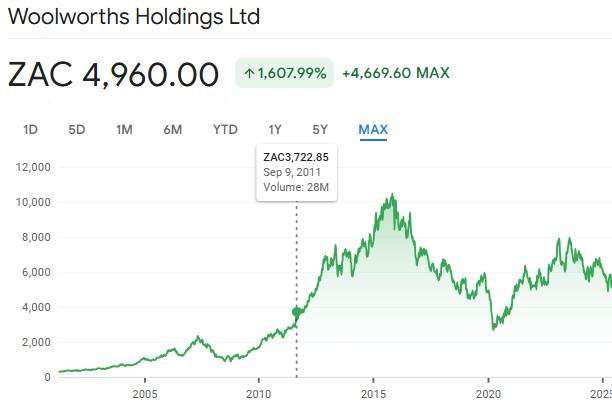

### Setup

Load all necessary packages. tidyverse for data wrangling, lubridate for dates, zoo/slider for rolling calculations, naniar to aid missingness understanding, and DT for interactive tabular inspection.

```{r setup, message=FALSE, warning=FALSE}
library(tidyverse)
library(lubridate)
library(zoo)       
library(ggplot2)
library(DT)        
library(naniar)
library(knitr)
library(slider)
```

### Load and Explore the Raw Data

Reads the raw CSV and inspect its tail/head to confirm it loaded as expected.

```{r load-data}
jse_data <- read_csv("input/ohlc_metrics.csv")

tail(jse_data) %>% 
  DT::datatable()
```

### Checking for duplicates

Ensuring uniqueness of each observation by checking Ticker + Date. Duplicates can distort aggregated features or bias models.

```{r check-dupes}
# Check for duplicates based on Ticker + Date
dup_count <- jse_data %>%
  count(Ticker, Date) %>%
  filter(n > 1)
print(dup_count)
```

### Missing value check

Most important part of data cleaning, and most sensitive for ML models. Count missing values globally and by ticker. This shows where the dataset has gaps and informs the imputation strategy

```{r missing-summary}
# Show count of missing values per column
colSums(is.na(jse_data))
```

### Missing Values Overview

```{r missing-by-ticker0}
# Count NAs by Ticker and Column
jse_data %>%
  group_by(Ticker) %>%
  summarise(across(where(is.numeric), ~sum(is.na(.)))) %>%
  arrange(desc(Close)) %>%
  DT::datatable()
```

## Impute Missing OHLCV Values (Forward Fill)

Forward-fill missing price and volume fields per ticker

```{r impute-prices}
# Sort by Ticker and Date
jse_data_clean <- jse_data %>%
  arrange(Ticker, Date) %>%
  group_by(Ticker) %>%
  mutate(
    Open = zoo::na.locf(Open, na.rm = FALSE),
    High = zoo::na.locf(High, na.rm = FALSE),
    Low = zoo::na.locf(Low, na.rm = FALSE),
    Close = zoo::na.locf(Close, na.rm = FALSE),
    Volume = zoo::na.locf(Volume, na.rm = FALSE)
  ) %>%
  ungroup()
```

We need continuous time series for each stock, many of our indicators like moving averages, daily returns, and volatilities are calculated from past price values. If there are gaps in prices, these features break down or become noisy. Forward filling preserves historical consistency without artificial jumps.

```{r missing-by-ticker}
# Count NAs by Ticker and Column
jse_data_clean %>%
  group_by(Ticker) %>%
  summarise(across(where(is.numeric), ~sum(is.na(.)))) %>%
  arrange(desc(Close)) %>% 
  DT::datatable()
```

## Recalculate Indicators After Imputation

After imputation, recompute all dependent features to avoid mixing true and stale/missing data.

```{r recalculate-indicators}
jse_data_clean <- jse_data_clean %>%
  arrange(Ticker, as.Date(Date)) %>%
  group_by(Ticker) %>%
  mutate(
    MA_20 = zoo::rollmean(Close, k = 20, fill = NA, align = "right"),
    MA_50 = zoo::rollmean(Close, k = 50, fill = NA, align = "right"),
    Daily_Return = (Close / lag(Close)) - 1,
    Volatility_30D = rollapply(Daily_Return, width = 30, FUN = sd, fill = NA, align = "right", na.rm = TRUE),
    Volatility_60D = rollapply(Daily_Return, width = 60, FUN = sd, fill = NA, align = "right", na.rm = TRUE),
    TPxVolume = Close * Volume,
    VWAP_7D = rollapply(
      TPxVolume, width = 7, FUN = sum, fill = NA, align = "right", na.rm = TRUE
    ) / rollapply(
      Volume, width = 7, FUN = sum, fill = NA, align = "right", na.rm = TRUE
    )
  ) %>%
  select(-TPxVolume) %>%
  ungroup()
```

Indicators like MA_20, MA_50, and Volatility_30D are key inputs to our models, especially for time series learning. It's important that they're calculated after imputing prices to avoid mixing true values with partial or missing histories. \### Drop N/A INdicators Drop rows that lack sufficient history to compute lookback-dependent features (e.g., first 50 days for MA_50), making the dataset consistent for modeling inputs.

```{r drop-na-indicators}
jse_data_dropped <- jse_data_clean %>%
  filter(!is.na(MA_20), !is.na(MA_50), !is.na(Daily_Return),
         !is.na(Volatility_30D), !is.na(Volatility_60D))
```

### Confirming Missing values fixed

```{r missing-by-ticker2}
jse_data_dropped %>%
  group_by(Ticker) %>%
  summarise(across(where(is.numeric), ~sum(is.na(.)))) %>%
  arrange(desc(Close)) %>%
  DT::datatable()
```

### Per Ticker Summary Stats

```{r view-data}
jse_data_dropped %>%
  group_by(Ticker) %>%
  summarise(
    Start = min(as.Date(Date)),
    End = max(Date),
    TradingDays = n(),
    AvgVolume = mean(Volume, na.rm = TRUE),
    AvgClose = mean(Close, na.rm = TRUE),
    Avg_VWAP_7D = mean(VWAP_7D, na.rm = TRUE)
  ) %>%
  arrange(desc(TradingDays)) %>%
  DT::datatable()
```

Persist both the fully cleaned version and the version trimmed for lookback consistency.

```{r save-dataset}
write_csv(jse_data_dropped, "output/jse_data_truncated.csv")
write_csv(jse_data_clean, "output/jse_data_clean.csv")
```

## EDA and Verifying Data Correctness

###  Date Coverage Consistency

We want to assess how much historical coverage we have for each ticker. This helps us identify tickers that were either listed recently or have thin/irregular trading data, both of which could affect training an ML model.

```{r count-trading-days}
# Count number of trading days per ticker
trading_days_by_ticker <- jse_data_clean %>%
  group_by(Ticker) %>%
  summarise(
    First_Date = min(Date),
    Last_Date = max(Date),
    Total_Trading_Days = n()
  ) %>%
  arrange(desc(Total_Trading_Days)) %>%
  DT::datatable()
```

Count tickers whose trading span exceeds a threshold (here 18 years) to know which have deep historical coverage for long-term modeling

```{r count-days}
# Compute span and filter
stocks_15y <- jse_data %>%
  group_by(Ticker) %>%
  summarise(
    start = min(Date),
    end = max(Date),
    span_years = as.numeric(interval(start, end) / years(1))
  ) %>%
  filter(span_years >= 18)

# Count and show which ones qualify
cat("Number of tickers with ≥18 years of data:", nrow(stocks_15y), "\n")
```

### Verification Against External Source

```{r absa-close-price, message=FALSE, warning=FALSE}
# Filter Absa Group data
absa_data <- jse_data %>%
  filter(Ticker == "ABGJ.J") %>%      
  mutate(Date = as.Date(Date)) %>%
  filter(Date >= as.Date("2020-07-30")) %>%
  arrange(Date)

# Plot closing price
ggplot(absa_data, aes(x = Date, y = Close)) +
  geom_line(color = "steelblue", linewidth = 1) +
  labs(
    title = "Absa Group Closing Price Since 2021",
    x = "Date",
    y = "Close Price (ZAR)"
  ) +
  theme_minimal()
```

```{r absa-price-externa-source}
knitr::include_graphics("figures/absa_chart.jpeg")
```

```{r woolies-close-price, message=FALSE, warning=FALSE}
# Filter Absa Group data
woolies_data <- jse_data %>%
  filter(Ticker == "WHLJ.J") %>%      
  mutate(Date = as.Date(Date)) %>%
  filter(Date >= as.Date("2005-05-30")) %>%
  arrange(Date)

# Plot closing price
ggplot(woolies_data, aes(x = Date, y = Close)) +
  geom_line(color = "steelblue", linewidth = 1) +
  labs(
    title = "Woolworths Closing Price Since 2021",
    x = "Date",
    y = "Close Price (ZAR)"
  ) +
  theme_minimal()
```

```{r woolies-price-externa-source}

```

### Comparing to data from the Invest System

We trim our daily series to month-end closing prices for the selected companies, then load the INVEST monthly dataset, align company naming, and plot each pair side-by-side to visually inspect consistency.

```{r filetering}
companies_to_plot <- c("WHLJ.J", "CLSJ.J", "MRPJ.J")  # Woolworths, Clicks, Mr Price

monthly_data <- jse_data_clean %>%
  filter(Ticker %in% c("WHLJ.J", "CLSJ.J", "MRPJ.J")) %>%
  mutate(Date = as.Date(Date)) %>%
  filter(Date >= as.Date("2009-01-01") & Date <= as.Date("2020-12-31")) %>%
  group_by(Ticker, YearMonth = floor_date(Date, "month")) %>%
  slice_max(Date, with_ties = FALSE) %>%  
  ungroup() %>%
  select(Date, YearMonth, Ticker, Close)

invest_data <- read.csv("input/INVEST_CompanyHistoricData.csv")
invest_to_plot <- invest_data %>%
  filter(Company %in% c("WOOLWORTHS HDG", "CLICKS GROUP", "MR PRICE GROUP")) %>%
  select(Date, Close, Company) %>%
  mutate(Date = as.Date(Date))
```

```{r plot-new}
ggplot(monthly_data, aes(x = Date, y = Close, color = Ticker)) +
  geom_line(size = 1) +
  labs(
    title = "Cleaned OHLCV Data - Monthly Closing Prices (2009–2020)",
    y = "Closing Price (ZAR)",
    x = "Date"
  ) +
  theme_minimal() +
  scale_color_manual(values = c("WHLJ.J" = "#1f77b4", "CLSJ.J" = "#2ca02c", "MRPJ.J" = "#d62728")) +
  theme(legend.title = element_blank())
```

```{r plot-invest}
ggplot(invest_to_plot, aes(x = Date, y = Close, color = Company)) +
  geom_line(size = 1) +
  labs(
    title = "INVEST Dataset - Closing Prices (Monthly)",
    y = "Closing Price (ZAR)",
    x = "Date"
  ) +
  theme_minimal() +
  scale_color_manual(values = c(
    "WOOLWORTHS" = "#1f77b4",
    "CLICKS GROUP" = "#2ca02c",
    "MR PRICE GROUP" = "#d62728"
  )) +
  theme(legend.title = element_blank())

```

Compute and compare average monthly closing prices (2009–2020) between the cleaned data and the INVEST benchmark for selected tickers. This acts as a sanity check that the cleaned series is in the same ballpark as an independent source.

```{r comparisonn}
# Map tickers to INVEST company names
ticker_map <- tibble(
  Ticker = c("WHLJ.J", "CLSJ.J", "MRPJ.J"),
  Company = c("WOOLWORTHS HDG", "CLICKS GROUP", "MR PRICE GROUP")
)

# Average close from cleaned data
avg_close_cleaned <- jse_data_clean %>%
  filter(Ticker %in% ticker_map$Ticker) %>%
  filter(Date >= as.Date("2009-01-01") & Date <= as.Date("2020-12-31")) %>%
  left_join(ticker_map, by = "Ticker") %>%
  group_by(Company) %>%
  summarise(avg_close_cleaned = mean(Close, na.rm = TRUE))

# Average close from INVEST data
avg_close_invest <- read.csv("input/INVEST_CompanyHistoricData.csv") %>%
  mutate(Date = as.Date(Date)) %>%
  filter(Company %in% ticker_map$Company) %>%
  filter(Date >= as.Date("2009-01-01") & Date <= as.Date("2020-12-31")) %>%
  group_by(Company) %>%
  summarise(avg_close_invest = mean(Close, na.rm = TRUE))

# Join for comparison
avg_close_comparison <- avg_close_cleaned %>%
  inner_join(avg_close_invest, by = "Company")

print(avg_close_comparison)
```

```{r summary}
cat("Summary of Cleaning and Verification Steps:\n")
cat("1. Loaded raw OHLCV dataset and inspected structure; checked for duplicate Ticker+Date rows.\n")
cat("2. Quantified missingness per column and per ticker to understand where gaps were.\n")
cat("3. Forward-filled missing OHLCV (Open, High, Low, Close, Volume) per ticker to create contiguous price series required for rolling/lag features.\n")
cat("4. Recomputed derived technical indicators on the cleaned series: moving averages, daily returns, volatilities, and VWAP.\n")
cat("5. Removed initial rows with insufficient lookback (i.e., where moving averages, returns or volatilities are NA) to get a modeling-ready slice.\n")
cat("6. Examined date coverage by company, comparing each ticker’s trading span against the one with maximal history.\n")
cat("7. Produced key per-company summary statistics (span, trading days, average volume/price/VWAP) for data sufficiency assessment.\n")
cat("8. Verified cleaned data for select tickers (Woolworths, Clicks, Mr Price) by comparing their average monthly closing prices over 2009–2020 to the INVEST benchmark.\n")

```
